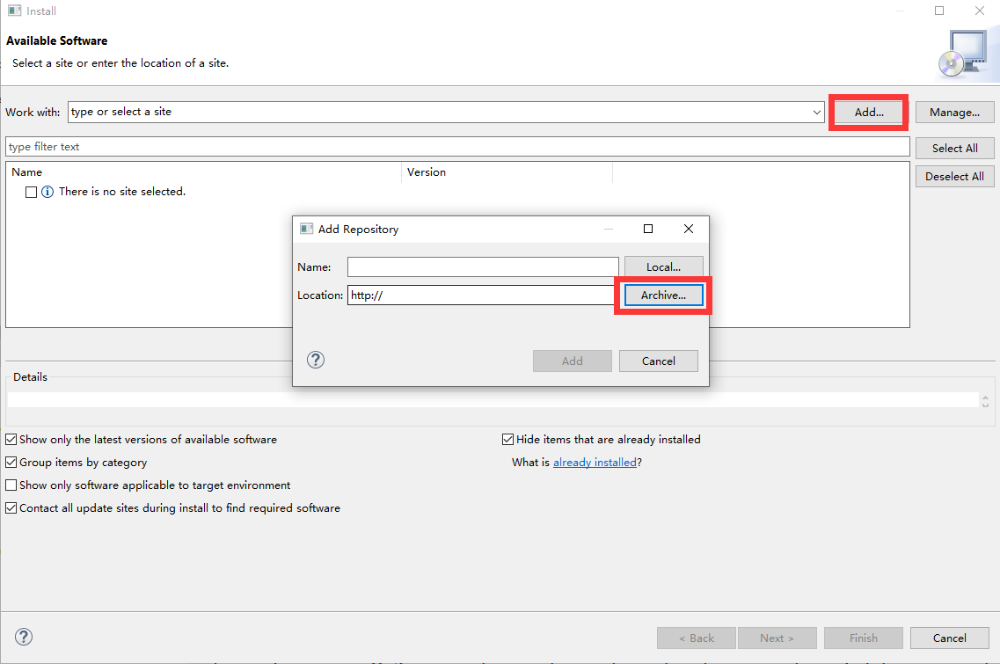
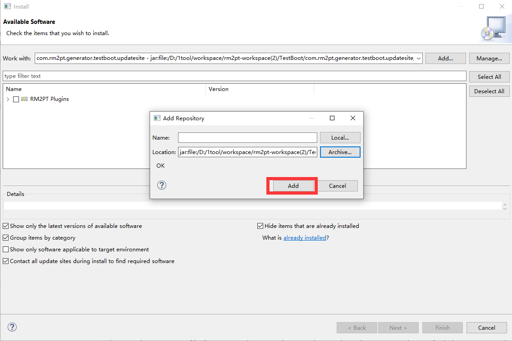

# RM2Doc(pdf)-Tool

RM2Doc(pdf)此版本可以生成tex文件，通过Eclipse TeXlipse自动编译为pdf文件。

### 准备工作

##### 1.latex环境的安装

点击链接下载[TeX Live - TeX Users Group (tug.org)](https://tug.org/texlive/)

##### 2.TeXlipse的安装

在rm2pt中安装，**Update Sites为:** http://download.eclipse.org/texlipse/2.0.3/

检查Builder Settings

### Use of RM2Doc(pdf)

##### Download

Click [here](https://github.com/Tians996/RM2Pdf-Tool/raw/main/com.rm2pt.generator.rm2pdf.updatesite-1.0.0-SNAPSHOT.zip) to download.

##### Install

Install in rm2pt, if you don't have rm2pt, [download here](https://github.com/RM2PT/Release/releases)

##### Create or import a project

For creating or importing a RM2PT project，you can see the tutorial [here](https://rm2pt.com/tutorial/user/create_new_project).

##### Generate a document

After you add a requirements model, you can generate document by right click on `cocome.remodel` -> `RM2Doc` -> `Generate PDF Document`

 

The generated document is in the `Doc-gen/Pdf` folder

